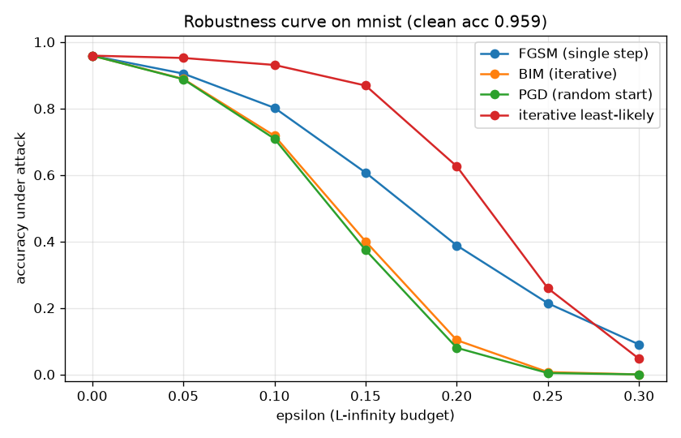
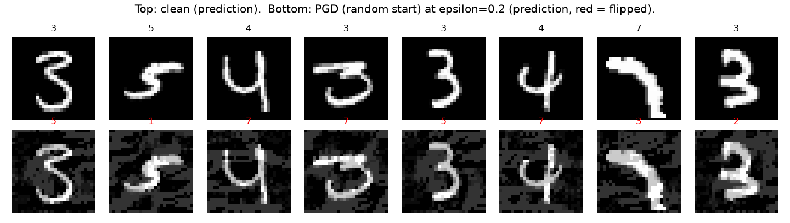

# adversarial-attacks

A short empirical study of one question, with clean-room PyTorch implementations of four L-infinity attacks and a config-driven sweep that reproduces every number offline.

## Question

How fast does the accuracy of a well-trained image classifier fall as the adversarial perturbation budget epsilon grows, and how much does that rate depend on the attack used to measure it?

The perturbation budget epsilon is the maximum change allowed to any single pixel, measured in the L-infinity norm on images kept in the raw [0, 1] range. A robustness curve plots accuracy under attack against epsilon, one line per attack. A flat curve would mean the model tolerates perturbations; a curve that plunges means the model is fragile.

## Method

- Victim: a compact two-block CNN trained on a 6000-image MNIST subset, kept in [0, 1] pixels so perturbations are bounded directly in pixel space. The trained weights are committed as `models/victim_mnist.pt` (about 1.7 MB).
- Sample: 1000 held-out MNIST test images carved to `data/sample_mnist.npz` (uint8, about 160 KB). This is a carved subset of the public MNIST test split, not synthetic.
- Attacks, all implemented from scratch in `src/advattack/attacks.py`:
  - FGSM, a single signed-gradient step (Goodfellow et al., 2015).
  - BIM, iterative FGSM with re-projection into the epsilon-ball (Kurakin et al., 2017).
  - PGD, the same iteration but starting from a random point inside the epsilon-ball (Madry et al., 2018). This is the strongest first-order attack in the suite.
  - Iterative least-likely, a targeted attack that drives each input toward the class the model deems least probable (Kurakin et al., 2017).
- Sweep: `scripts/sweep.py` loads the committed victim and sample, evaluates every attack at each epsilon, and writes the robustness curve, an adversarial-example grid, `results/metrics.json`, and `RESULTS.md`. A single fixed seed makes PGD's random start reproducible. No training and no network access are involved.

## Reproduce

```
python -m venv .venv
.venv\Scripts\activate            # Windows, or: source .venv/bin/activate
pip install -e ".[dev]"           # add torch CPU wheel on Linux, see below
python scripts/sweep.py --config configs/mnist_sweep.json
```

That command runs offline in a few seconds on a CPU and regenerates the two figures, `metrics.json`, and `RESULTS.md`. It is also installed as the console command `advattack-sweep`. On Linux CI, install the CPU build of PyTorch first: `pip install torch torchvision --index-url https://download.pytorch.org/whl/cpu`.

To retrain the victim and re-carve the sample from scratch (this step needs the dataset):

```
python scripts/train_victim.py --dataset mnist --epochs 3 --sample 1000
```

Configs live in `configs/`. `mnist_sweep.json` runs all four attacks; `fgsm_pgd_only.json` runs a two-attack, 20-step comparison. Point `--config` at either, or write your own.

## Findings

Measured this session on the committed 1000-image sample, clean accuracy 0.9590, single seed, iterative attacks at 10 steps. Values are accuracy under attack, so lower means a more effective attack.

| epsilon | FGSM | BIM (iterative) | PGD (random start) | iterative least-likely |
| --- | --- | --- | --- | --- |
| 0.00 | 0.9590 | 0.9590 | 0.9590 | 0.9590 |
| 0.05 | 0.9050 | 0.8890 | 0.8880 | 0.9520 |
| 0.10 | 0.8020 | 0.7180 | 0.7090 | 0.9310 |
| 0.15 | 0.6070 | 0.4000 | 0.3740 | 0.8690 |
| 0.20 | 0.3880 | 0.1030 | 0.0800 | 0.6260 |
| 0.25 | 0.2140 | 0.0070 | 0.0040 | 0.2590 |
| 0.30 | 0.0900 | 0.0000 | 0.0000 | 0.0470 |





Three things stand out, all as observed. First, the fall is steep for every attack: a perturbation of epsilon 0.20, small enough that the digits remain clearly legible to a human, already cuts accuracy from 0.96 to below 0.40 under the single-step FGSM and to below 0.10 under the iterative methods. Second, the attack matters as much as the budget. PGD is the strongest at every nonzero epsilon and BIM tracks it closely, both far below single-step FGSM, because taking several small re-projected steps searches the epsilon-ball more thoroughly than one step can, and PGD's random start finds a slightly better descent path than BIM's fixed start. Third, the targeted least-likely attack degrades accuracy more slowly at small budgets, since forcing one specific wrong label is harder than causing any error, but it too collapses the model once the budget is large. The adversarial grid shows the effect concretely: at epsilon 0.20 every one of the eight PGD examples flips to a wrong label while remaining visually a clear digit.

## Limitations

- White-box and L-infinity only. All four attacks read the model's gradients and bound perturbations in the L-infinity norm. No black-box, transfer, L2, or L0 attacks.
- No defense. This measures vulnerability, it does not harden the model. There is no adversarial training and no certified robustness here.
- Small scope by design. One compact victim, one dataset, a single seed, and a 1000-image sample. The numbers illustrate the shape of the robustness curve rather than benchmark a production model. Retrain with `train_victim.py` and widen the epsilon grid in a config to probe further.

## Layout

```
src/advattack/      library: model, data, attacks (fgsm, bim, pgd, least-likely), config, runner
scripts/            sweep.py (offline CLI), train_victim.py, download_data.py
configs/            JSON sweep configs
models/             committed pretrained victim (victim_mnist.pt)
data/               committed sample_mnist.npz (full dataset gitignored)
results/            robustness_curve.png, adversarial_examples.png, metrics.json
notebooks/          demo.ipynb, executed offline from the committed artifacts
tests/              pytest suite, runs on synthetic data offline
RESULTS.md          regenerated table and figures from the last sweep
```

## References

- Goodfellow, Shlens, Szegedy, Explaining and Harnessing Adversarial Examples, 2015 (FGSM).
- Kurakin, Goodfellow, Bengio, Adversarial Examples in the Physical World, 2017 (BIM and iterative least-likely).
- Madry, Makelov, Schmidt, Tsipras, Vladu, Towards Deep Learning Models Resistant to Adversarial Attacks, 2018 (PGD).

## Author

Aamir Malik

- GitHub: https://github.com/aamirmalik-dr
- LinkedIn: https://linkedin.com/in/dr-aamirmalik

## License

MIT, see LICENSE.
